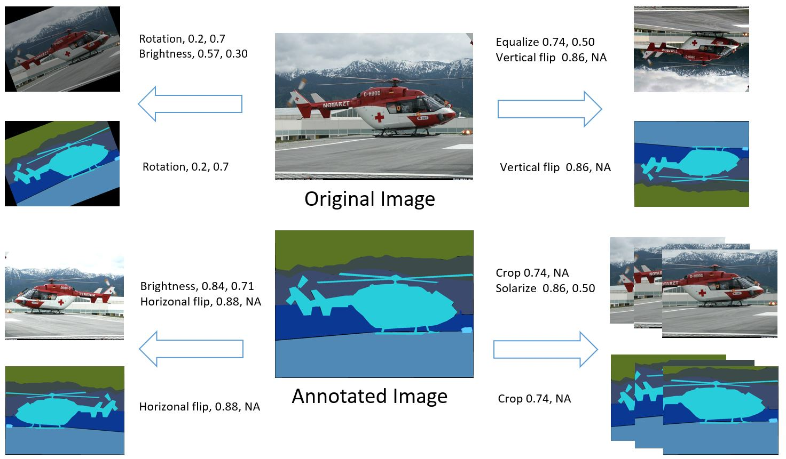
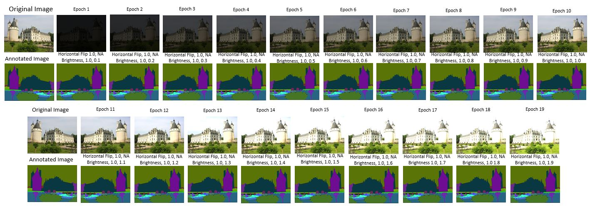
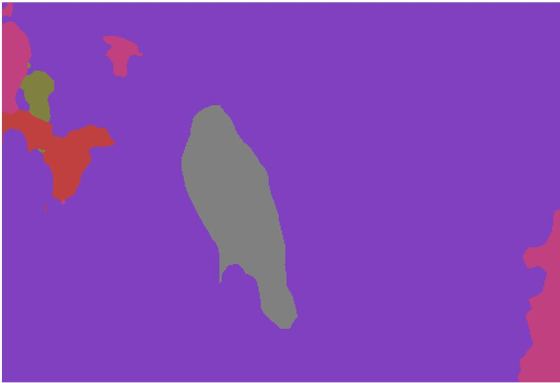
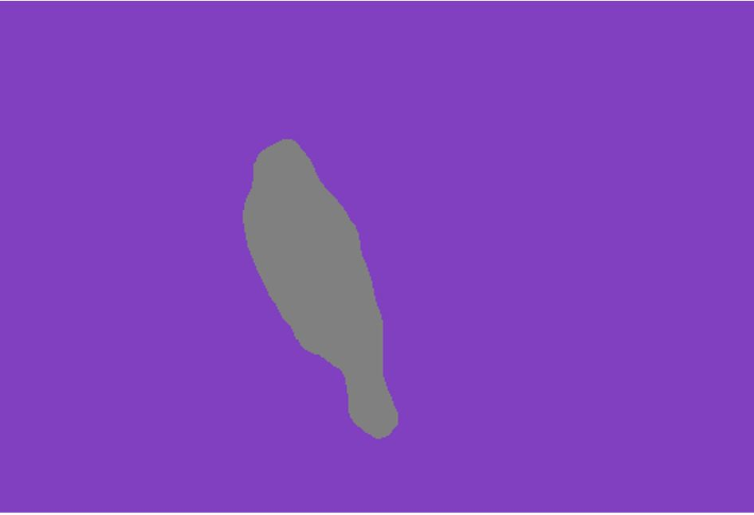

# Improved Image Semantic Segmentation based on Cascade Data Augmentation
[[Home]](http://monibsediqi.github.io)    [[Paper]](http://monibsediqi.github.io)   [[Home]](http://wuhuikai.me) 


Implementation of CDA for Image Semantic Segmentation: Rethinking Dilated Convolution in the Backbone for Semantic Segmentation**.   
A **Stronger** framework for semantic segmentation, achieving the state-of-the-art performance
```
@inproceedings{CSCI2020,
  title     = {Improved Image Semantic Segmentation based on Cascade Data Augmentation},
  author    = {Khwaja Monib Sediqi and Hyo Jong Lee},
  booktitle = {International Conference on Computation Science and Computational Intelligence},
  year = {2020}
}
```
Contact: Monib Sediqi (monib.korea@gmail.com)


## Overview
### Data Augmentation

### Cascade Data Augmentation


## Install
1. [PyTorch >= 1.1.0](https://pytorch.org/get-started/locally) (Note: The code is test in the environment with `python=3.6, cuda=9.0`)
2. Download **cda_semantic_segmentation**
   ```
   git clone https://github.com/Monibsediqi/cda_semantic_segmentation.git
   cd cda_semantic_segmentation
   ```
3. Install Requirements
   ```
   nose
   tqdm
   scipy
   cython
   requests
   ```

## Train and Test
### PContext
```
python -m scripts.prepare_pcontext
```
| Method | Backbone | Baseline (mIoU)  | Ours (mIoU) |
|:----|:----|:---:|:---:|
| Deeplabv2 | ResNet-101 + COCO | 45.7 | **46.79** |
| RefineNet | ResNet-152 | 47.3 | **49.62** |
| EncNet | ResNet-101 | 51.7 | **52.27** |
| DUsampling | Xception-71 | **54.91**  |  |
| PSPNet | ResNet-101 | 43.29 (MS) | **44.47** | 
| FastFCN | ResNet-50 | 51.2  | **52.16**  |
### 
## Visual Results
|Dataset|Input|FastFCN|Ours|
|:----|:---:|:---:|:---:|
|PContext||||

## Acknowledgement
I would like to acknowledge [PyTorch-Encoding](https://github.com/zhanghang1989/PyTorch-Encoding).
for  using their code in this research. 
